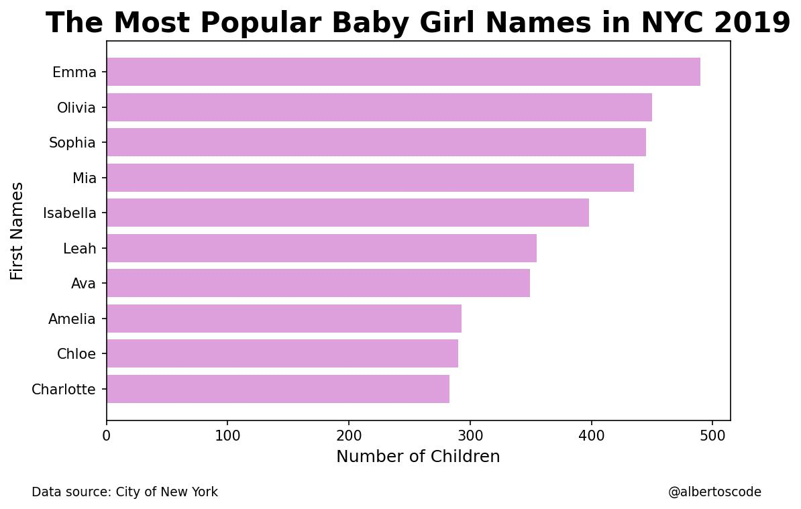

# The Most Popular Baby Names in the City of New York in 2019

After exploring, processing and analyzing the data, one of the results was the compilation of the top ten baby names in New York City for 2019.

## Charts

## References

City of New York. (2022). NYC Open Data. Opendata.cityofnewyork.us. Retrieved 22 April 2022, from https://data.cityofnewyork.us/Health/Popular-Baby-Names/25th-nujf. 

Harris, C., Millman, K., van der Walt, S., Gommers, R., Virtanen, P., & Cournapeau, D. et al. (2022). Array programming with NumPy. Springer Science and Business Media LLC. 

Hunter, J. (2007). Matplotlib: A 2D graphics environment. IEEE COMPUTER SOC. 

Kanz, A. (2020). Klib. 

Kluyver, T., Ragan-Kelley, B., Perez, F., Granger, B., Bussonnier, M., & Frederic, J. et al. (2016). Jupyter Notebooks - a publishing format for reproducible computational workflows. In Positioning and Power in Academic Publishing: Players, Agents and Agendas (pp. 87-90). Netherlands; IOS Press. Retrieved 19 May 2022, from https://eprints.soton.ac.uk/403913/. 

The pandas development team. (2020). pandas-dev/pandas: Pandas. Zenodo. 

van Rossum, G. (1991). Python. Python Software Foundation. 

## Author

Alberto

- [@albertoscode](https://github.com/albertoscode)

## Feedback

If you have any feedback, please write to the following email address: ah8664383@gmail.com

